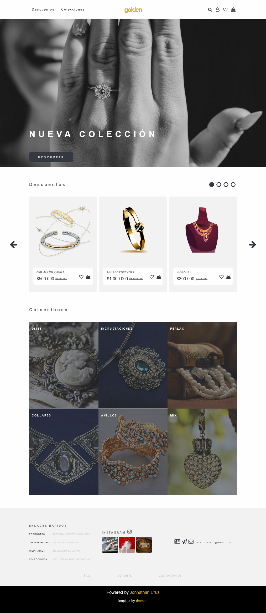

# Golden. Css Grid

## Descripción

Estudio personal en HTML y hojas de estilo CSS. Busco convertir la investigación en landing pages de sitios ficticios inpirados en el moodboard 'Dev' en mi [ Pinterest](https://pin.it/5y19mMg), el cual alimento y refresco contínuamente. En esta ocasión la exploración corresponde al layout GRID, pasando por áreas, rejillas personalizadas y el modelo 12-columns.

Aquí puedes explorar la [Demo funcional](https://jonnathan-cruz.000webhostapp.com/portfolio/Golden-CssGrid/index.html).

Y aquí puedes ver [todo mi portafolio!!!](https://jonnathan-cruz.000webhostapp.com) -> Ready to Roll Out! 

## Instalación

Solo descargar y navegar al index.html de la raíz (no requiere apache).

## Screenshots

### Mobile:

### Desktop:

## Pruebas

Explora los estilos css en herramientas para desarrollador del navegador para visualizar las GRID utilizadas.

## Créditos

### Tutoriales:
https://freefrontend.com/css-grid-examples/

### Inspiración principal:
https://mir-s3-cdn-cf.behance.net/project_modules/max_3840/c111a3168070271.64b3269f2f88e.png

### Assets:

- Imagen de <a href="https://www.pexels.com/photo/a-woman-s-hand-holding-a-diamond-ring-18337006/"> Amar Preciado </a> en pexels.

- Imagen de <a href="https://www.joyeriasfussie.com/"> joyerias Fussie </a> en Fussie.

- Imagen de <a href="https://www.freepik.es/vector-gratis/anillo-dorado-realista-diamante_14657406.htm#query=joyeria%20de%20oro&position=4&from_view=search&track=ais&uuid=c2cb35c1-a410-487e-a200-da6489ba74a5">Freepik</a> en Freepik

- Imagen de <a href="https://www.freepik.es/vector-gratis/joyas-dibujos-animados-colgantes-oro-reloj-aretes_26568789.htm#query=joyeria%20de%20oro&position=2&from_view=search&track=ais&uuid=b8c4bc82-e9f3-4c3a-a07e-d3a9c360c1c4">Freepik</a> en Freepik

- Imagen de <a href="https://pixabay.com/es/users/noname_13-2364555/?utm_source=link-attribution&utm_medium=referral&utm_campaign=image&utm_content=2867205">NoName_13</a> en <a href="https://pixabay.com/es//?utm_source=link-attribution&utm_medium=referral&utm_campaign=image&utm_content=2867205">Pixabay</a>

- Imagen de <a href="https://pixabay.com/es/users/mianshahzadraza-1991967/?utm_source=link-attribution&utm_medium=referral&utm_campaign=image&utm_content=1175533">Mian Shahzad Raza</a> en <a href="https://pixabay.com/es//?utm_source=link-attribution&utm_medium=referral&utm_campaign=image&utm_content=1175533">Pixabay</a>

- Imagen de <a href="https://pixabay.com/es/users/kriemer-932379/?utm_source=link-attribution&utm_medium=referral&utm_campaign=image&utm_content=784422">Kerstin Riemer</a> en <a href="https://pixabay.com/es//?utm_source=link-attribution&utm_medium=referral&utm_campaign=image&utm_content=784422">Pixabay</a>

- Imagen de <a href="https://pixabay.com/es/users/nile-598962/?utm_source=link-attribution&utm_medium=referral&utm_campaign=image&utm_content=623169">Nile</a> en <a href="https://pixabay.com/es//?utm_source=link-attribution&utm_medium=referral&utm_campaign=image&utm_content=623169">Pixabay</a>

- Imagen de <a href="https://pixabay.com/es/users/kropekk_pl-114936/?utm_source=link-attribution&utm_medium=referral&utm_campaign=image&utm_content=281251">Anna</a> en <a href="https://pixabay.com/es//?utm_source=link-attribution&utm_medium=referral&utm_campaign=image&utm_content=281251">Pixabay</a>

- Imagen de <a href="https://pixabay.com/es/users/kriemer-932379/?utm_source=link-attribution&utm_medium=referral&utm_campaign=image&utm_content=954922">Kerstin Riemer</a> en <a href="https://pixabay.com/es//?utm_source=link-attribution&utm_medium=referral&utm_campaign=image&utm_content=954922">Pixabay</a>

- Imagen de <a href="https://pixabay.com/es/users/javaistan-16472466/?utm_source=link-attribution&utm_medium=referral&utm_campaign=image&utm_content=6471186">Afif Ramdhasuma</a> en <a href="https://pixabay.com/es//?utm_source=link-attribution&utm_medium=referral&utm_campaign=image&utm_content=6471186">Pixabay</a>

- Imagen de <a href="https://pixabay.com/es/users/bellahu123-10783290/?utm_source=link-attribution&utm_medium=referral&utm_campaign=image&utm_content=4577174">Bella H.</a> en <a href="https://pixabay.com/es//?utm_source=link-attribution&utm_medium=referral&utm_campaign=image&utm_content=4577174">Pixabay</a>

- Imagen de <a href="https://pixabay.com/es/users/cj-83527/?utm_source=link-attribution&utm_medium=referral&utm_campaign=image&utm_content=3403638">CJ</a> en <a href="https://pixabay.com/es//?utm_source=link-attribution&utm_medium=referral&utm_campaign=image&utm_content=3403638">Pixabay</a>

## Licencia

Este código se distribuye bajo licencia GPLv3.

